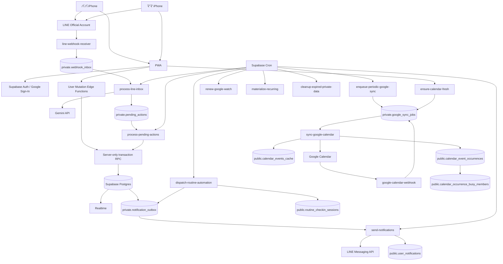

# 01. Architecture — v6 normative

## 1. 全体

## 2. Frontend

- React + TypeScript + Vite
- PWA
- iOS Safari/home screen first
- static hosting compatible routing
- Service Worker = app shell + read cache only
- MVP offline write禁止
- PWA deep links:
  - `/today?date=YYYY-MM-DD`
  - `/checkin/:sessionId`
  - `/requests/:requestId`
  - `/shopping`
  - `/calendar/week/:mondayDate`

## 3. Backend

Supabase:
- Auth
- Postgres
- RLS
- Realtime
- Edge Functions
- Cron (`pg_cron` + `pg_net`)
- Vault / Edge secrets

### Cron cadence

| job | cadence | purpose |
|---|---:|---|
| `process-line-inbox` | every 1 min | LINE durable inbox |
| `process-pending-actions` | every 1 min | confirmed LINE action execution |
| `send-notifications` | every 1 min | LINE/in-app outbox |
| `dispatch-routine-automation` | every 1 min | weekly/daily checklist/check-in schedules |
| `enqueue-periodic-google-sync` | every 30 min | missed webhook fallback |
| `renew-google-watch` | every 6 hours | renew channels expiring within 24h |
| `materialize-recurring` | daily 00:10 Asia/Tokyo | 14-day tasks |
| `cleanup-expired-private-data` | daily 03:30 | retention |

Cron scheduleはmigration/infra codeで正本化する。

## 4. Cron -> worker authentication

v6で1方式に固定。

- 256-bit random `CRON_WORKER_TOKEN`
- Supabase Vaultに保存
- Edge Function secretにも同値を保存
- pg_cron/pg_net request header: `X-Family-Ops-Worker-Token`
- worker-only Edge Functionsはtokenをconstant-time compare
- missing/wrong -> 401
- token value/log hashをapplication logへ出さない
- browser user functionとworker-only functionをendpoint levelで分離
- rotation: new tokenをEdge secret + Vaultへ設定 → cron header切替 →旧token無効化

## 5. DB schema responsibility

### `public`
RLSでhousehold/user scoped readを許可する共有データ。
Client direct writeは原則なし。

### `private`
Data API/browserから不可。
- raw inputs
- OAuth credential
- invites/link token hashes
- webhook inbox
- notification outbox
- pending actions
- Google watch/sync internals
- Google write operation log
- mutation receipts
- scheduled dispatch receipts
- staging

## 6. Mutation boundary

v5では曖昧な`RPC / Edge Function`を禁止する。

### browser / PWA
**Edge Function only**。

Edge:
1. JWT verify
2. actor=`auth user`
3. canonical membership fetch
4. resource household reauthorize
5. normalized payload + operation id
6. server-only transaction RPC call

### server-only transaction RPC — v5 fixed transport
Atomic transaction entrypointは **`public.server_tx_*`** に置く。`private.tx_*` をData API経由で直接呼ばない。

- `public` schemaはData APIに露出されるが、各`server_tx_*` functionは `REVOKE EXECUTE FROM PUBLIC, anon, authenticated`
- `GRANT EXECUTE ... TO service_role`
- Edge Functionはservice-role Supabase clientから `supabase.rpc('server_tx_...')`
- functionは`SECURITY INVOKER`
- `service_role`だけが`private` schemaへ必要最小限のUSAGE/DML privilegeを持つ
- `anon` / `authenticated`は`private` schema USAGEなし
- private helperを`SECURITY DEFINER`にする場合のみ `SET search_path=''` + schema-qualified ref

これによりprivate schemaをExposed Schemasへ追加しないまま、Edgeからatomic RPCを実行する。

## 7. App Auth / Calendar OAuth separation

### App Auth
Supabase Auth Google Sign-In。Family Ops本人認証のみ。

### Calendar OAuth
別OAuth flow。
- Calendar scope
- offline access
- refresh token encrypted at rest
- `private.google_connections`をhouseholdへDB binding
- App Auth provider tokenをdurable Calendar credentialに使わない

## 8. Queue standard

Durable queues:
- webhook_inbox
- notification_outbox
- google_sync_jobs
- pending_actions

Common:
- status
- attempts
- next_attempt_at
- lease_owner
- lease_until
- lease_token fresh each claim
- last_started_at
- last_error sanitized
- max attempts
- dead state

Claim:
- transaction + `FOR UPDATE SKIP LOCKED`
- expired lease reclaim
- terminal update requires same id+lease_token

### google_sync_jobs state machine
Only:
- queued
- processing
- done
- dead

Transient failure:
`processing -> queued`, set next_attempt_at, clear lease, retain attempts.

Success + rerun_requested=true:
**same row** atomically returns to queued, rerun=false, next_attempt_at=now, clear lease.

No `failed` state.
Partial unique active job remains `(calendar_connection_id) WHERE status IN ('queued','processing')`.

## 9. User mutation idempotency

`private.mutation_receipts` canonical.

- actor_id
- operation_id
- action_type
- request_hash
- result_type
- result_id
- result_payload minimal json
- created_at
- UNIQUE(actor_id,operation_id)

Transaction semantics are in `18_MUTATION_CONTRACT_MATRIX.md`.

## 10. External side-effect idempotency

### LINE monthly quota
- provider limit/usageをLINE Messaging APIから定期refresh
- `private.line_quota_state`を正本cacheとして使う
- priority=`critical|normal|reminder`
- soft budget初期180、critical reserve初期20
- reminderはsoft budget到達後LINEせずin-app fallback
- hard limit到達後はpush attemptしない
- quota fallbackはqueue failure/dead扱いにしない
- immediate webhook responseはvalid reply tokenがあればreplyを優先し、counted pushを温存

### LINE push
- notification_outbox gets provider_retry_key UUID at creation
- initial push and all retries use same `X-Line-Retry-Key`
- provider duplicate acceptance reconciled as sent

### Google create
- deterministic remote event ID: `fo` + UUID lowercase hex without hyphens
- Family Ops operation id also stored in private extended properties
- `private.google_write_operations` tracks request hash/status/etag
- timeout retry uses same Google event ID
- duplicate 409 => GET same ID then reconcile

### Google update
- stable event ID
- If-Match with cached etag
- timeout => GET/reconcile
- 412 => GET latest, do not blind overwrite

## 11. Google correctness

- push = latency signal
- 30m incremental = correctness fallback
- app stale check = UX fallback
- manual refresh = operator fallback
- all triggers coalesce into one active sync job per calendar
- syncToken advances only after all pages + canonical DB reconcile succeed
- 410 full sync uses staging then atomic replacement/reconcile

## 12. Scheduled LINE correctness

- scheduler evaluates household local time every minute
- dispatch receipt and outbox insertion same DB transaction
- same recipient/same minute schedule kinds bundle into one outbox message
- check-in sessions snapshot intended task references
- reminder queries latest task status before sending
- completed session => reminder suppression
- assignment changed => supersede old session and notify both parties immediately

## 13. Concurrency invariants

- recurring occurrence: stable unique logical key
- recurrence overlap: DB exclusion constraint (`btree_gist`)
- request accept: row lock/CAS
- user mutation: operation receipt
- queue: lease token
- scheduled notification: dispatch receipt
- Google: one active sync job/calendar
- Google create: deterministic remote id

## 13. v5 fixed scheduler semantics

- MVP timezone=`Asia/Tokyo` only。household timezone columnはCHECKで固定し、timezone変更UIは作らない。
- `materialize-recurring`は毎日00:10 JST（15:10 UTC）に固定Cron。
- weekly digest preflight等user-facingではないslotは`private.worker_run_receipts(worker_kind,logical_slot_key)`で冪等化。
- backup freshnessのSupabase Cronは廃止。GitHub Actions自身がR2 upload後のHEAD/size/hash検証を行う。

## 14. v6 Edge gateway/auth contract

`EDGE_FUNCTION_AUTH_MATRIX.md` と `supabase/config.toml` が正本。

- user mutation: `verify_jwt=true`
- external provider callback/webhook: `verify_jwt=false` + provider verification
- cron worker: `verify_jwt=false` + `X-Family-Ops-Worker-Token`

provider/worker handlerは認証成功前にservice-role clientでDBへ触らない。
config/matrix mismatchはCI failure。

## 15. v6 LINE hard-free quota architecture

- `APP_LINE_MONTHLY_HARD_CAP=200`
- `effective_hard_limit=min(provider_reported_limit,200)`
- provider call前にDB transactionで1 permitをreserve
- race時もrow lock下で`provider/local/reservation`をまとめて判定
- success => committed + local success increment
- definitive failure => release
- timeout/5xx ambiguous => reservation保持
- retry key safety expiry=first attempt+23h
- expiry後delivery不明 => LINE再送せず`delivery_unknown`
- quota不足 => `fallback` + durable in-app history

## 16. v6 non-workday scheduler architecture

JST local dateでweekend/holidayを先に判定。
non-workdayならweekday role scheduleは評価しない。

- 09:00 today digest
- 20:00 check-in
- Sunday 09:00はnext-week sectionもbundle

Holiday cache:
- `private.jp_holidays`
- official Cabinet Office CSV
- weekly sync worker
- checked-in fixture fallback
