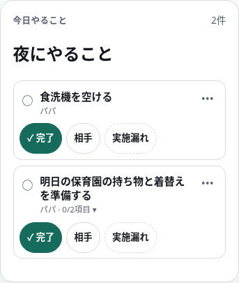
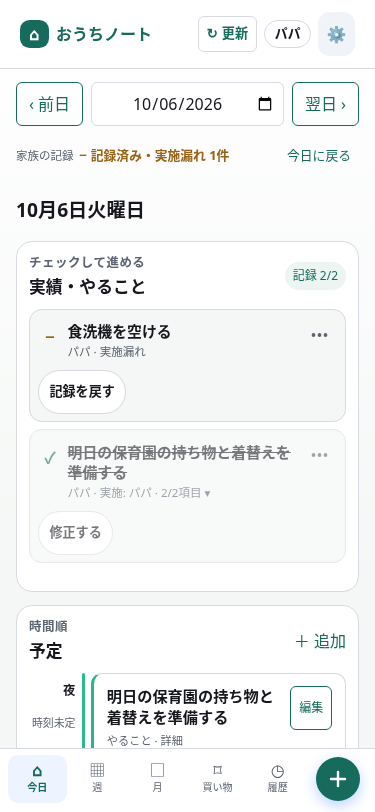
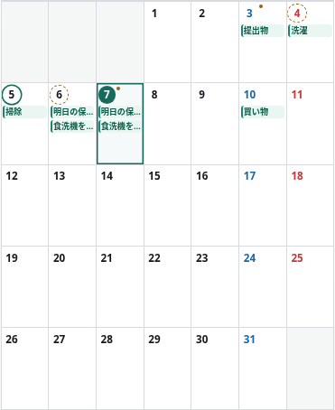

# 日ごとの記録・操作の見直し（PR #154）

このページは実装済みの変更案を、実際のブラウザー画面で確認するためのものです。本番にはまだ反映していません。幅375pxのスマートフォン表示を使用し、すべて架空のサンプルデータです。

## 操作の変更前・変更後

| 変更前 | 変更後 |
| --- | --- |
|  |  |

変更前は、通常の作業では左の丸、チェックリストでは「全部やった」を押していました。変更後は両方とも「完了」を押します。左の丸は状態を示し、チェックリストの項目はタイトルから開きます。

「実施漏れ」は、実行できなかったことをその日の結果として記録します。未記録からは外れますが、実施したことにはなりません。間違えて押した場合は「記録を戻す」で戻せます。

「完了」「相手」「実施漏れ」は1行に並び、いずれも1回で操作できます。320px幅でも折り返さず、操作部分の高さは44px以上です。タスク単体はボタンを増やした分だけ少し高くなっています。別日の概要3枠の撤去や準備カードの整理で、ページ全体の余分な高さを抑えています。

## 別の日を記録し終えたホーム

日付のすぐ下に家族全体の記録状況を表示します。日付を切り替えても、作業一覧までスクロールせずに状態を確認できます。

- 未記録が残る日：**未記録 2件**
- すべて実施した日：**すべて完了**
- 実施漏れも含めて記録が揃った日：**記録済み・実施漏れ 1件**
- 作業がない日：**やることなし**
- 未来の未完了の作業：**未完了 2件**（まだ記録漏れとは扱いません）

別日のホームでは作業を予定より先に置き、記録と確認がすぐできる順序にしました。

## 月間の印

- **5日の緑の実線の丸**：すべて完了。
- **4日・6日の点線の丸**：実施漏れなどを含め、すべて記録済み。
- **3日・7日の小さな点**：今日までの日に未記録がある。
- **10日**：未来なので、未完了の作業があっても記録漏れの点は付けません。

既存の日付の位置に印を付けるので、各日のセルの高さを増やしません。日付を押せば内訳を確認できます。色だけで区別せず、線と点の形も変えています。日付の音声読み上げにも状態を含めています。

## この配置にした理由と代案

| 判断した点 | 現案の理由 | 代案とその違い |
| --- | --- | --- |
| 完了操作の統一 | どの作業でも、文字で示した「完了」を押す。チェックリストだけ別の操作になる迷いを減らす。 | 左の丸をすべての作業の完了ボタンに揃える案は省スペース。ただし、項目を開く操作との違いと、一括完了する範囲が文字ほど伝わりやすくない。 |
| 実施漏れを表に出す | 完了と並べ、記録を後回しにしなくて済む。 | 「…」内に残す案は見た目が静か。ただし、毎日の記録に毎回もう1操作必要になる。 |
| 相手の完了操作 | 全3操作を1回で押せることを優先。「相手が完了」では狭い画面で折り返したため、表示を「相手」に短縮。 | 「完了」「実施漏れ」の2つを表に出し、「相手が完了」を「…」へ移す案は意味が明確で、行も短い。相手分の記録が1操作増える。 |
| 月間の状態表示 | 日付を囲む丸と小さな点で、既存スペースを使う。 | 各セルに「完了」「未記録」を書く案は説明なしでも読めるが、予定の表示場所が減る。セル全体の塗り分けは目立つが、今日・選択中の強調と重なる。 |
| ホームの日付ごとの状態 | 日付直下に短い1行を置き、切り替えた瞬間に確認できる。 | 作業一覧の末尾だけに表示する案は上部が短くなるが、確認にスクロールが必要になる。 |

現案でまだ検討余地があるのは「相手」の言葉です。操作回数は少ない一方、単独では意味が弱くなっています。相手の分を記録する頻度が低い場合は、上の2ボタン案のほうが読みやすくなります。

## ホーム全体の比較

| 変更前 | 変更後 |
| --- | --- |
|  |  |

コードと検証結果は [PR #154](https://github.com/syoudai0514/family-ops/pull/154) で確認できます。
